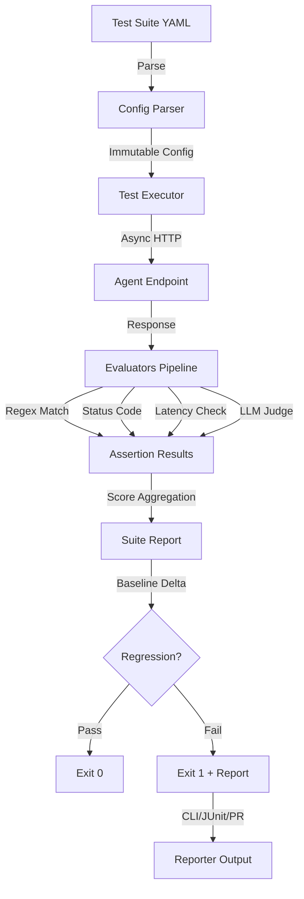
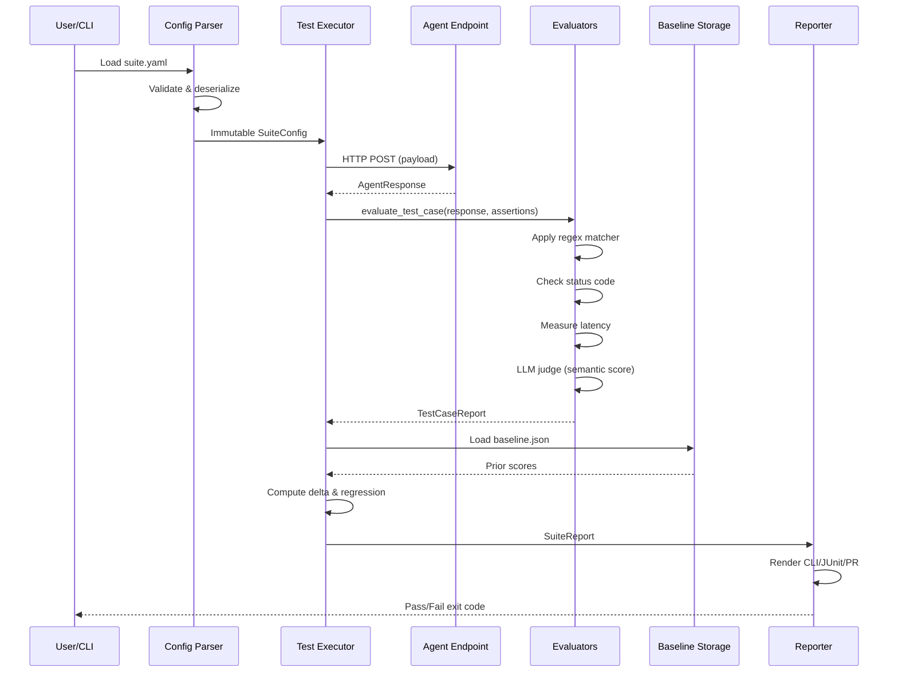

# ADR 001: Assay Architecture — Functional Core + Imperative Shell for Regression Testing

## Status
Accepted

## Context

Assay is a regression testing framework for AI agents. Traditional testing tools fail on semantic evaluation—a prompt adjustment or model update can fix one edge case while silently breaking five others. The framework must:

1. Execute test suites asynchronously against agent endpoints
2. Evaluate semantic correctness using LLM-as-a-judge with no vendor lock-in
3. Track baseline performance across commits (git-versioned)
4. Report results across multiple formats (CLI, JUnit, PR comments, JSON)
5. Handle non-deterministic model behaviors with reproducible scoring

## Decision

Adopt a **Functional Core + Imperative Shell** architecture:

- **Functional Core**: Pure, immutable domain logic (evaluators, scoring, aggregation)
  - No side effects; all types frozen (Pydantic `frozen=True`)
  - Evaluators are first-class functions: regex match, latency check, JSON schema, LLM judge
  - Composable pipeline: test case → [assertions] → scores → aggregation → report
  
- **Imperative Shell**: I/O, transport, state management
  - Config parsing (PyYAML → dataclasses)
  - Async HTTP dispatch to agent endpoints (httpx)
  - Baseline storage (baseline.json in git)
  - Multi-target reporters (CLI, JUnit XML, GitHub PR, JSON)

## Consequences

### Benefits
✅ **Testability**: Pure functions = 100% coverage without mocks  
✅ **Composability**: Add new assertion types by extending evaluators  
✅ **Determinism**: Reproducible test runs across machines  
✅ **Parallelization**: No shared state; safe to parallelize evaluations  
✅ **Auditability**: Complete trace of all scoring decisions  

### Trade-offs
⚠️ Imperative shell adds complexity for file I/O and HTTP coordination  
⚠️ Immutability enforced (no performance optimization via mutation)  
⚠️ DSL-driven config (YAML) requires learning test syntax

## Architecture Diagram

### Request Flow


### Component Interaction Sequence


## Implementation Details

### Domain Types (Functional Core)
```python
@dataclass(frozen=True)
class AssertionSpec:
    type: Literal["regex", "status_code", "latency", "json_schema", "llm_judge"]
    expected: Any
    tolerance: Optional[float] = None

@dataclass(frozen=True)
class TestCaseReport:
    test_name: str
    passed: bool
    scores: Dict[str, float]
    violations: List[str]
    latency_ms: float
```

### Evaluators (Pure Functions)
```python
def evaluate_regex(response: str, pattern: str) -> bool:
    return bool(re.search(pattern, response))

def evaluate_latency(latency_ms: float, max_ms: float) -> bool:
    return latency_ms <= max_ms

def evaluate_llm_judge(response: str, assertion: AssertionSpec) -> float:
    # Returns similarity score (0.0–1.0), no side effects
    score = model.judge_semantic_alignment(response, assertion.expected)
    return score
```
\n### CI Integration
- **GitHub Actions**: Composite action + container
- **Exit codes**: 0 (all pass), 1 (regressions detected)
- **Baseline tracking**: baseline.json committed to main branch

## Related Decisions
- ADR-002: Model agnosticism via LiteLLM abstraction
- ADR-003: YAML test specs for human-readable, git-friendly definitions
